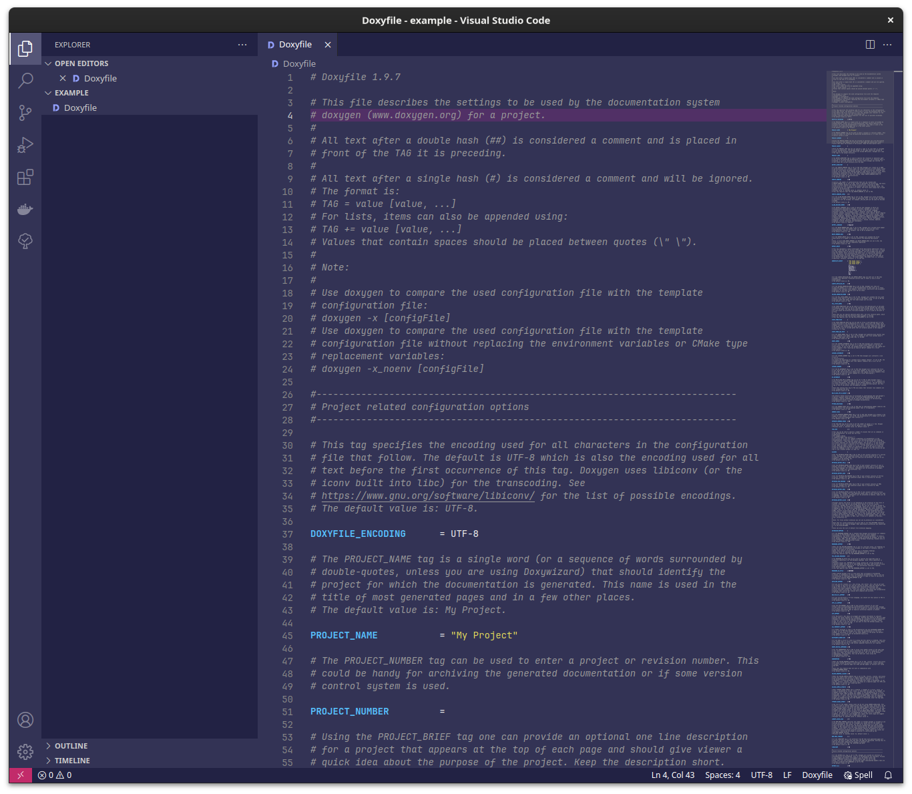
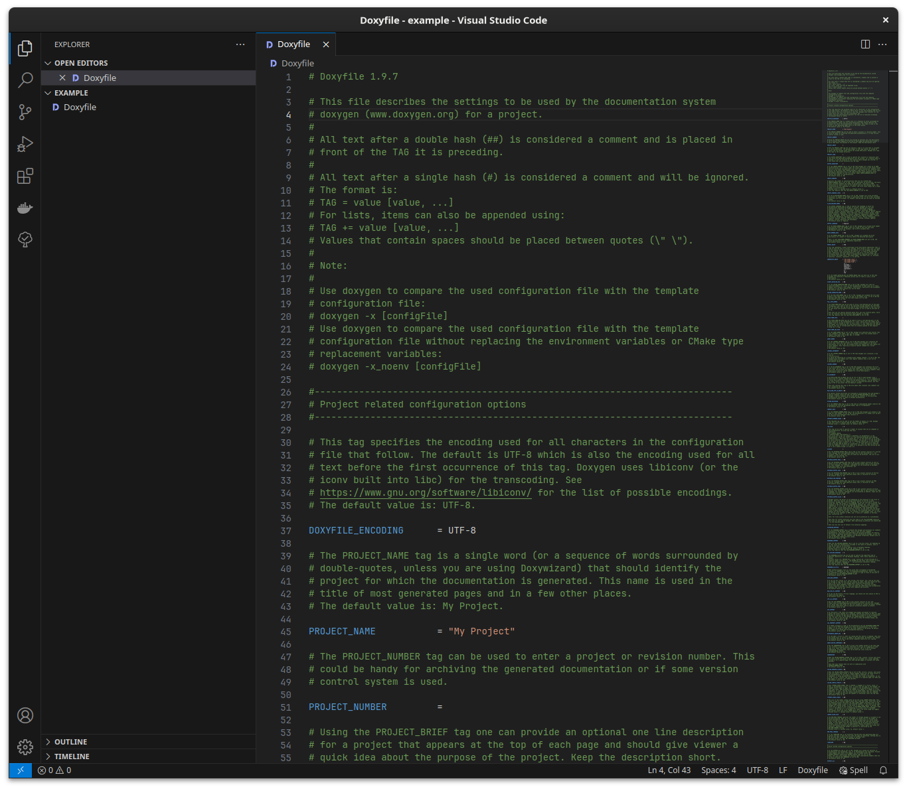
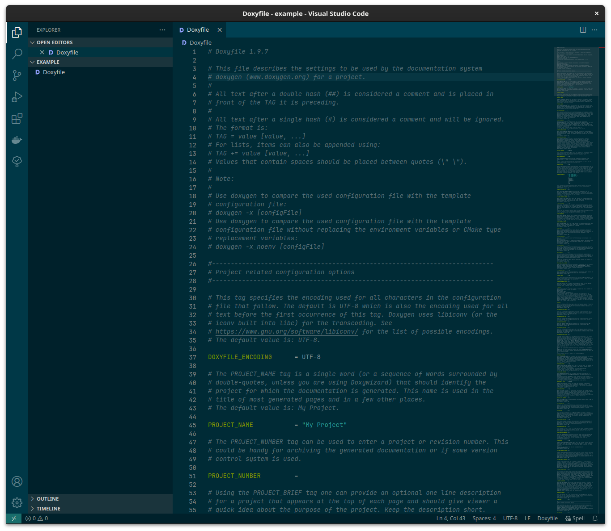
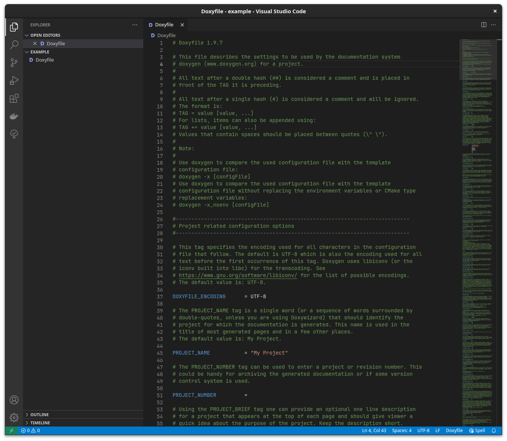
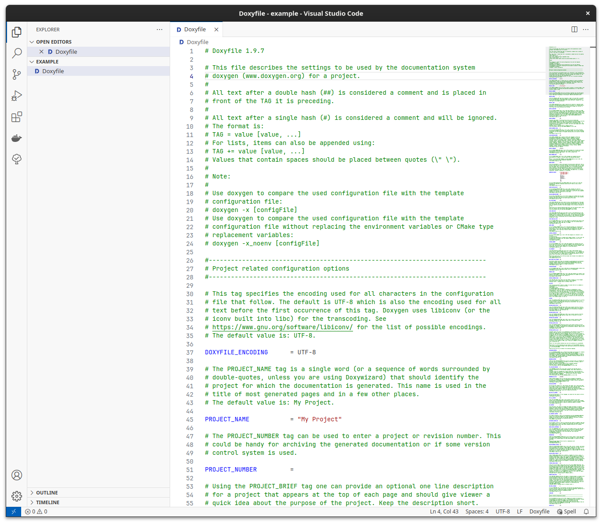
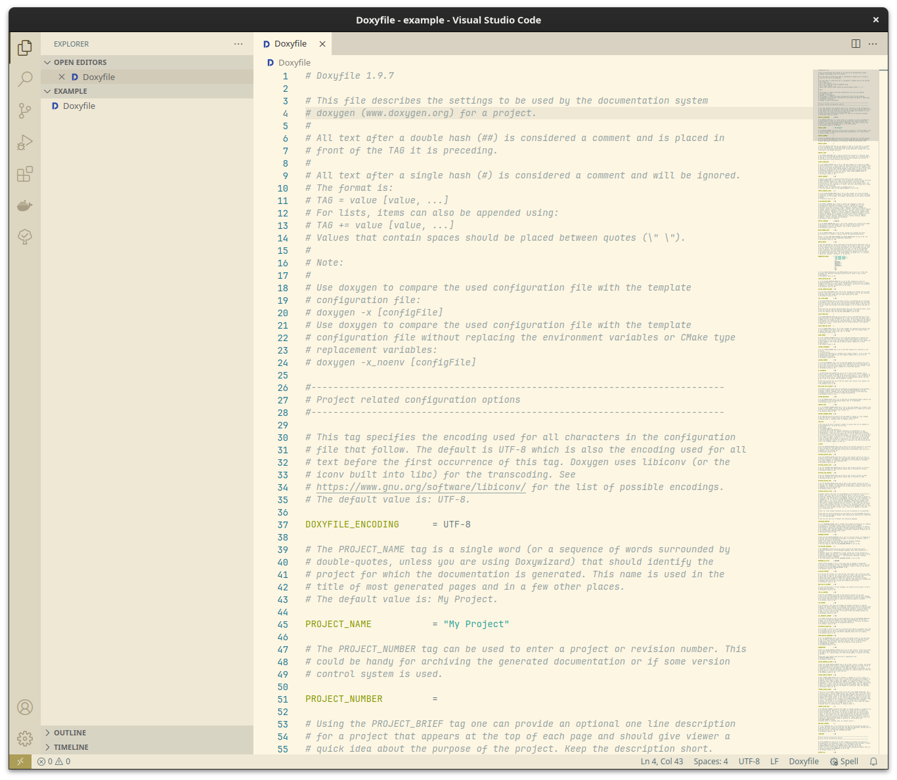
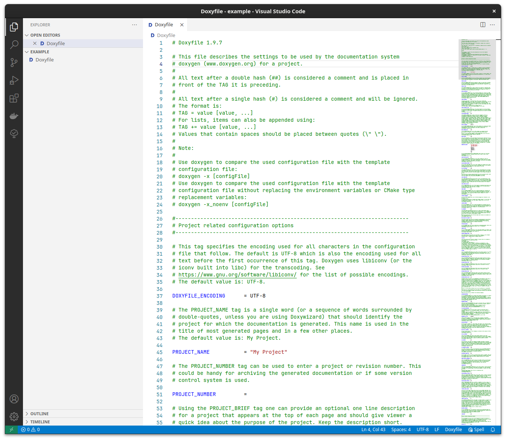

# VS Code Doxyfile Extension

The VS Code Doxyfile Extension provides syntax highlighting for your Doxyfile configuration file and an appropriate file
icon.

## ⭐ Features

 - Syntax highlighting
 - File icons (🌙 and 💡)
 - Comment shortcut
 - Automatic filetype detection

## 🌙 Dark Icon

## 💡 Light Icon

## 📝 License

[MIT](LICENSE)