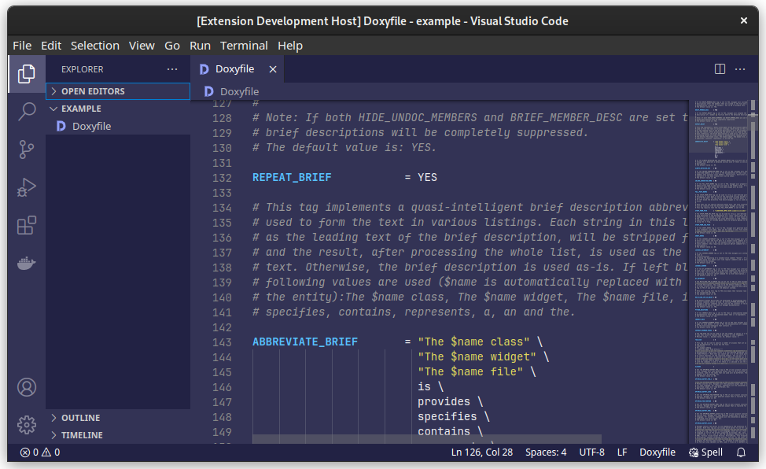

# VS Code Doxyfile Extension

The VS Code Doxyfile Extension provides syntax highlighting for your Doxyfile configuration file and an appropriate file
icon.

## ⭐ Features

 - Syntax highlighting
 - File icon

## 📝 License

[MIT](LICENSE)